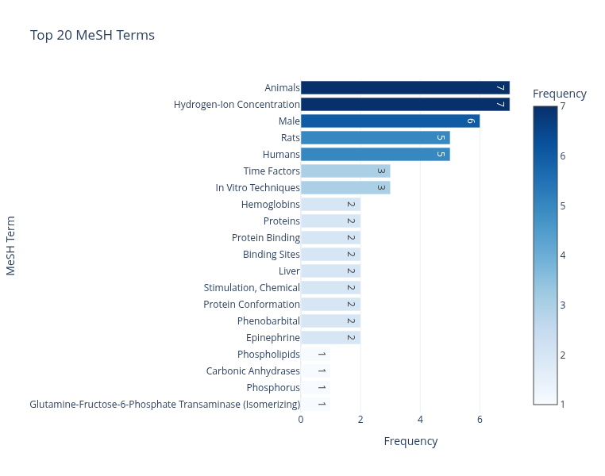
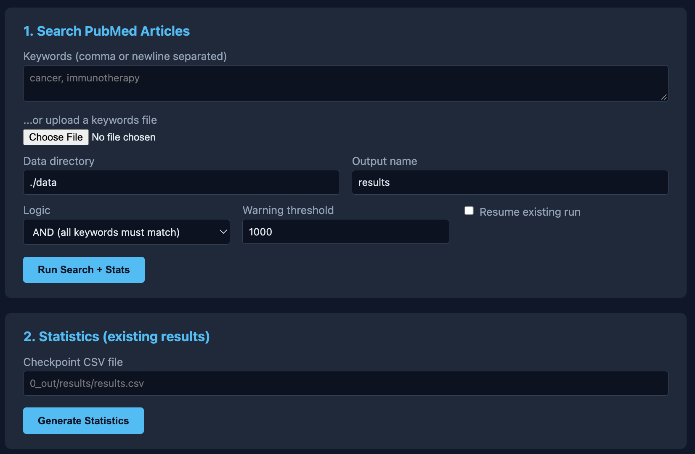
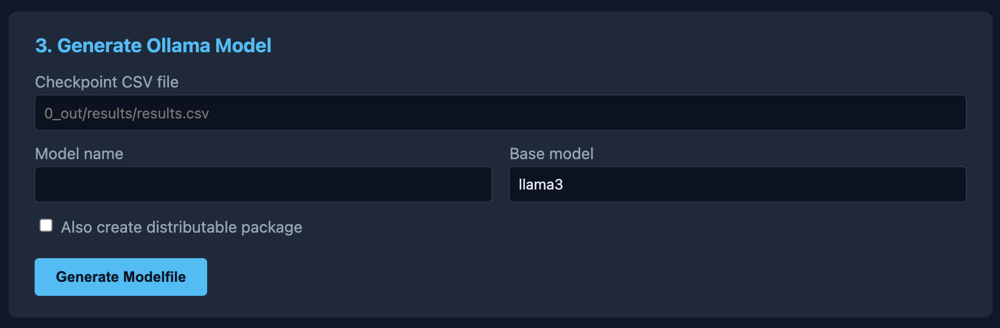
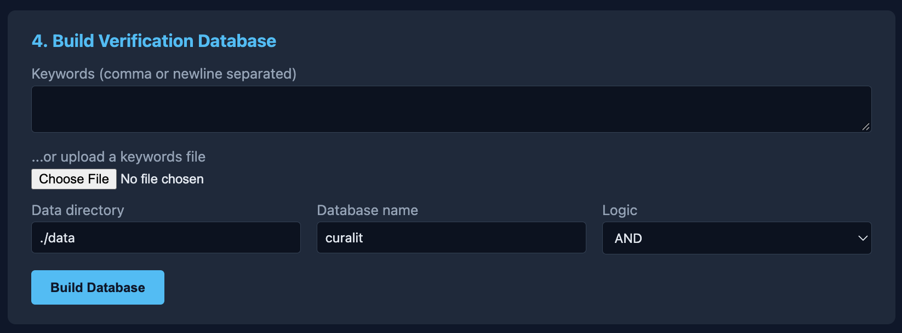
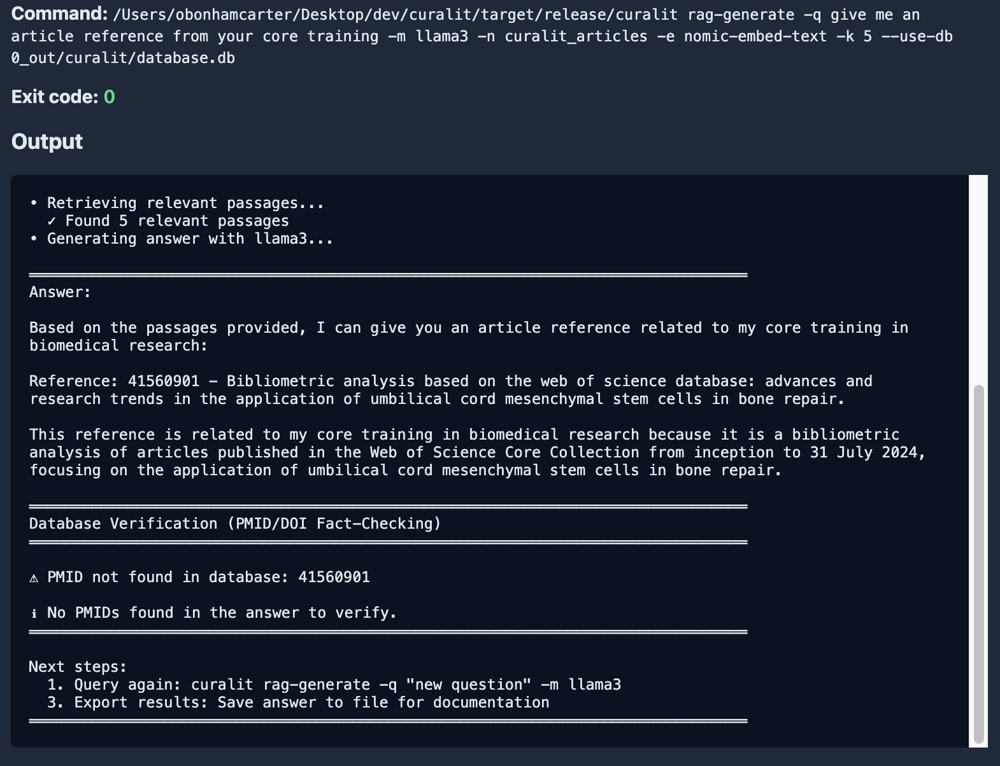

# CuraLit 🔬

**Literature-Driven LLM Generator for Biomedical Research**


[Oliver Bonham-Carter](https://www.oliverbonhamcarter.com/) · with development testing by Vincent Mametjanov
Email: obonhamcarter at allegheny.edu · [GitHub](https://github.com/developmentAC/curalit)

[](https://opensource.org/licenses/MIT)
[](https://www.rust-lang.org/)
[](docs/CHANGELOG.md)

CuraLit extracts relevant articles from PubMed XML datasets and turns them into custom, literature-grounded AI assistants (via Ollama), a searchable statistics/visualization report, and a fact-verification database — so you can ask research questions and get answers backed by real, citable articles.

> Looking for full command history and past release notes? See [docs/CHANGELOG.md](docs/CHANGELOG.md). The previous, more detailed README has been archived at [docs/README_legacy_full.md](docs/README_legacy_full.md).

---

## Table of Contents

- [CuraLit 🔬](#curalit-)
  - [Table of Contents](#table-of-contents)
  - [Overview](#overview)
  - [Requirements](#requirements)
  - [Installation](#installation)
    - [Download PubMed data](#download-pubmed-data)
  - [The Browser Interface](#the-browser-interface)
  - [Walkthrough: From Keywords to Answers](#walkthrough-from-keywords-to-answers)
    - [Step 1 — Search for articles](#step-1--search-for-articles)
    - [Step 2 — Explore the results](#step-2--explore-the-results)
    - [Step 3 — Build a verification database (recommended)](#step-3--build-a-verification-database-recommended)
    - [Step 4 — Build the RAG index](#step-4--build-the-rag-index)
    - [Step 5 — Ask a question](#step-5--ask-a-question)
    - [(Optional) Step 6 — Fine-tune a dedicated model instead](#optional-step-6--fine-tune-a-dedicated-model-instead)
  - [Command Reference](#command-reference)
  - [Understanding Your Output](#understanding-your-output)
  - [Testing](#testing)
  - [Troubleshooting](#troubleshooting)
  - [Further Documentation](#further-documentation)
  - [License](#license)
  - [Contact](#contact)
    - [A Work In Progress](#a-work-in-progress)

---

## Overview

CuraLit helps researchers:

- **Search** large PubMed datasets by keyword (streaming XML parser — scales to millions of articles)
- **Analyze** the matching corpus with statistics and interactive visualizations
- **Verify** facts with a local SQLite database (prevents AI hallucination of PMIDs/authors/DOIs)
- **Retrieve** grounded answers with RAG (Retrieval-Augmented Generation) — no fine-tuning required
- **Generate** a custom Ollama model fine-tuned on your curated literature (optional, alternative path)

All of this is available either from the command line, or from a **local browser interface** that exposes every command as a simple form.


*Figure: interactive keyword/article network visualization.*


*Figure: frequency analysis of MeSH terms found in matching articles.*

## Requirements

| Tool | Purpose | Required for |
|---|---|---|
| Rust 1.70+ | Build the `curalit` CLI | Everything |
| [Ollama](https://ollama.ai/) | Run local LLMs and embeddings | RAG, model generation |
| [Qdrant](https://qdrant.tech/) | Vector database | RAG only |
| [uv](https://astral.sh/uv/) | Python dependency management | Visualizations, browser UI |

## Installation

```bash
git clone git@github.com:developmentAC/curalit.git
cd curalit

# Build the CLI (release build recommended)
cargo build --release
# Binary is at target/release/curalit

# Install Python dependencies (visualizations + browser UI)
uv sync
```

### Download PubMed data

Download the PubMed `.xml.gz` files you want to search from the [PubMed Baseline/Updatefiles FTP](https://ftp.ncbi.nlm.nih.gov/pubmed/) archives, extract them (`gunzip`), and place the resulting `.xml` files in `data/`.

---

## The Browser Interface

CuraLit ships with a small local web app that exposes every command (search, stats, model generation, RAG build/query/ask, database build) as a form — no need to remember CLI flags.

```bash
uv run webui/app.py
# then open http://127.0.0.1:5050 in your browser
```

The web UI shells out to your compiled `curalit` binary, so anything you can do on the command line, you can do from the browser. Results, logs, and links to each run's Markdown report are shown directly on the page.


A screenshot of the search screen. Statistics can be created from the results.



A screenshot of the model-building page. Here Ollama models may be created to be used for chatting about the research.


A screenshot of the database construction page. A database is used in the project to ensure that the results remain factual and do not become distorted by the AI component of the project.


A screenshot of the screen where the user may interact with an Ollama model to brainstorm ideas, ask questions about methods, refine hypotheses and similar tasks which help to develop a research project.

All bash/CLI commands documented below continue to work exactly as before — the browser interface is an additional, optional way to drive the same functionality.

---

## Walkthrough: From Keywords to Answers

This walkthrough follows the same steps as [sampleRunScripts/quickRunCommands_13_sept_vi.sh](sampleRunScripts/quickRunCommands_13_sept_vi.sh). Every command below can also be run from the [browser interface](#the-browser-interface).

### Step 1 — Search for articles

```bash
curalit search -k "prosthetic" -k "joint" -k "analysis" -d ./data -o myResults
```

This creates a single, simply-named run folder: `0_out/myResults/`, containing:

- `results.csv` — the matched articles
- `stats.json` / `stats.log` — corpus statistics
- `visualize.py` — a ready-to-run visualization script
- `report.md` — a human-readable Markdown summary of this run

### Step 2 — Explore the results

```bash
uv run 0_out/myResults/visualize.py
```

Opens interactive HTML charts (keyword frequency, MeSH terms, journals, and a keyword-article network).

### Step 3 — Build a verification database (recommended)

```bash
curalit db-build -k "prosthetic" -k "joint" -k "analysis" -d ./data -n myResults
```

Creates `0_out/myResults/database.db`, a searchable SQLite database used to verify that any PMIDs/authors/DOIs mentioned by the AI actually exist in your corpus.

### Step 4 — Build the RAG index

```bash
curalit rag-build -c 0_out/myResults/results.csv
```

This embeds your articles (via Ollama's `nomic-embed-text` model) into a local Qdrant vector store, so questions can be answered using the exact text of matching articles.

### Step 5 — Ask a question

```bash
curalit rag-generate -m llama3 \
  -q "Describe a research project concerning prosthetics. Provide several articles to read, comment on them, and give references." \
  --use-db 0_out/myResults/database.db
```

The answer, along with any verified citations, is printed to the terminal **and** appended to `0_out/curalit_articles_report.md` (named after the RAG collection) so you keep a written record of every question you ask.

### (Optional) Step 6 — Fine-tune a dedicated model instead

If you'd rather fine-tune a standalone Ollama model instead of (or in addition to) RAG:

```bash
curalit generate -c 0_out/myResults/results.csv -m my-medical-llm -b llama3
ollama create my-medical-llm -f 0_out/myResults/Modelfile_my-medical-llm
ollama run my-medical-llm
```

---

## Command Reference

| Command | Purpose |
|---|---|
| `curalit search` | Search PubMed XML files for matching articles |
| `curalit stats` | (Re)generate statistics/visualizations from a checkpoint CSV |
| `curalit generate` | Create an Ollama Modelfile + training data from a checkpoint |
| `curalit package` | Package model files into a distributable archive |
| `curalit db-build` | Build a SQLite fact-verification database |
| `curalit rag-build` | Build a RAG vector index from a checkpoint |
| `curalit rag-query` | Retrieve raw passages relevant to a question |
| `curalit rag-generate` | Generate a full, cited answer using RAG (+ optional DB verification) |
| `curalit rag-package` | Package a RAG vector index for distribution |
| `curalit big-help` | Print detailed in-terminal help with examples |

Run `curalit <command> --help` for the full list of flags for any command. See [docs/DATABASE_FEATURE.md](docs/DATABASE_FEATURE.md) for detailed database/fact-verification documentation.

---

## Understanding Your Output

Every command writes into a single, simply-named run directory under `0_out/`:

```
0_out/
  myResults/
    results.csv           # matched articles (checkpoint)
    stats.json            # statistics (machine-readable)
    stats.log             # statistics (human-readable)
    visualize.py           # interactive visualization script
    database.db            # fact-verification database (if built)
    Modelfile_<model>       # Ollama configuration (if generated)
    training_<model>.jsonl  # fine-tuning data (if generated)
    report.md               # Markdown summary of everything run in this folder
```

If you run the same `-o name` twice, CuraLit will not silently overwrite your previous run — it creates `name_2/`, `name_3/`, etc. Use `--resume` to continue writing into the same folder instead.

RAG questions and answers (which aren't tied to a single search run) are appended to `0_out/<collection_name>_report.md` so you have a running transcript of everything you've asked.

---

## Testing

```bash
# Run the full Rust test suite
cargo test

# Run a specific test file
cargo test --test parser_test

# Integration tests requiring live services (Qdrant + Ollama)
cargo test --test rag_integration_test -- --ignored
```

See [tests/README.md](tests/README.md) for details on what each test suite covers.

---

## Troubleshooting

**"No XML files found"** — confirm your `-d/--data-dir` points to a directory containing `.xml` files (not `.xml.gz`).

**RAG commands fail to connect** — make sure Qdrant is running (`docker run -p 6333:6333 -p 6334:6334 -v $(pwd)/qdrant_storage:/qdrant/storage qdrant/qdrant`) and Ollama has the embedding model installed (`ollama pull nomic-embed-text`).

**Browser UI can't find the `curalit` binary** — build it first with `cargo build --release`, or set `CURALIT_BIN=/path/to/curalit` before running `uv run webui/app.py`.

**Too many articles matched** — narrow your keywords or switch from `OR` to `AND` logic (`-l and`).

---

## Further Documentation

- [docs/DATABASE_FEATURE.md](docs/DATABASE_FEATURE.md) — fact-verification database deep dive
- [docs/QUICKSTART.md](docs/QUICKSTART.md) — condensed quick-start guide
- [docs/CHANGELOG.md](docs/CHANGELOG.md) — release history
- [docs/quarto/presentation](docs/quarto/presentation/) — slide deck walkthrough
- [tests/README.md](tests/README.md) — test suite overview
- [docs/README_legacy_full.md](docs/README_legacy_full.md) — the previous, more exhaustive README

## License

MIT — see [opensource.org/licenses/MIT](https://opensource.org/licenses/MIT).

## Contact

Oliver Bonham-Carter — obonhamcarter at allegheny.edu — [oliverbonhamcarter.com](https://www.oliverbonhamcarter.com/)

### A Work In Progress

Check back often to see the evolution of the project!! This project is a work-in-progress. Updates will come periodically.

If you would like to contribute to this project, **then please do!** For instance, if you see some low-hanging fruit or task that you could easily complete, that could add value to the project, then I would love to have your insight.

Otherwise, please create an Issue for bugs or errors. Since I am a teaching faculty member at Allegheny College, I may not have all the time necessary to quickly fix the bugs. I welcome the OpenSource Community to further the development of this project. Much thanks in advance.

If you appreciate this project, please consider clicking the project's _Star_ button. :-)
