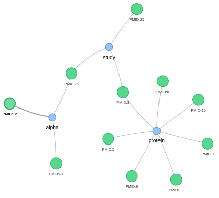

# CuraLit 🔬

**Literature-Driven LLM Generator for Biomedical Research**


Date: 18 June 2026

[Oliver Bonham-Carter](https://www.oliverbonhamcarter.com/)

Email: obonhamcarter at allegheny.edu

Github: [https://github.com/developmentAC/curalit](https://github.com/developmentAC/curalit)

CuraLit is a powerful Rust-based tool that extracts relevant articles from PubMed XML datasets and generates custom Large Language Models (LLMs) tailored for research purposes. Perfect for novice and expert researchers who need specialized AI assistants trained on curated scientific literature.

[](https://opensource.org/licenses/MIT)
[](https://www.rust-lang.org/)
[](CHANGELOG.md)

> **Latest Update (v0.4.0)**: Matched Keywords Tracking! The Keywords column now automatically populates with your search terms that matched each article, making it easy to see exactly which keywords triggered each match. Plus all the great features from v0.3.x: SQLite database feature with fact verification! Build searchable databases from PubMed articles and verify RAG responses against ground truth. Prevents AI hallucination of PMIDs, authors, and DOIs. Includes full-text search (FTS5), fast indexed lookups, and automatic citation verification. See [DATABASE_FEATURE.md](DATABASE_FEATURE.md) for details.

## Table of Contents

- [CuraLit 🔬](#curalit-)
  - [Table of Contents](#table-of-contents)
  - [🎯 Overview](#-overview)
  - [✨ Key Features](#-key-features)
    - [🚀 **Memory-Efficient Processing**](#-memory-efficient-processing)
    - [🎯 **Flexible Keyword Matching**](#-flexible-keyword-matching)
    - [💾 **Checkpoint System**](#-checkpoint-system)
    - [📊 **Statistical Analysis**](#-statistical-analysis)
    - [📈 **Interactive Visualizations**](#-interactive-visualizations)
    - [🤖 **LLM Generation**](#-llm-generation)
    - [🔍 **RAG (Retrieval-Augmented Generation)**](#-rag-retrieval-augmented-generation)
    - [🗄️ **SQLite Database for Fact Verification** (NEW in v0.3.2!)](#️-sqlite-database-for-fact-verification-new-in-v032)
    - [🎨 **User-Friendly Interface**](#-user-friendly-interface)
  - [📋 Requirements](#-requirements)
  - [🔧 Installation](#-installation)
    - [1. Clone the Repository](#1-clone-the-repository)
    - [2. Build from Source](#2-build-from-source)
    - [3. Install Globally (Optional)](#3-install-globally-optional)
    - [4. Install Python Dependencies](#4-install-python-dependencies)
    - [5. Download the PubMed Corpus](#5-download-the-pubmed-corpus)
  - [Documentation \& Tutorials](#documentation--tutorials)
    - [Interactive Presentation](#interactive-presentation)
  - [�🚀 Quick Start](#-quick-start)
    - [Basic Workflow](#basic-workflow)
    - [RAG Workflow (NEW - Recommended for Accuracy!)](#rag-workflow-new---recommended-for-accuracy)
      - [Automated Setup (Recommended)](#automated-setup-recommended)
      - [Manual Setup (Step-by-Step)](#manual-setup-step-by-step)
    - [Database Workflow for Fact Verification (NEW in v0.3.2!)](#database-workflow-for-fact-verification-new-in-v032)
  - [📚 Usage Guide](#-usage-guide)
    - [Search Command](#search-command)
    - [Stats Command](#stats-command)
    - [Generate Command](#generate-command)
    - [Package Command](#package-command)
    - [Database Build Command (NEW in v0.3.2!)](#database-build-command-new-in-v032)
    - [RAG Commands (NEW in v0.3.0!)](#rag-commands-new-in-v030)
      - [Why Use RAG?](#why-use-rag)
      - [RAG Build Command](#rag-build-command)
      - [RAG Query Command](#rag-query-command)
      - [RAG Generate Command](#rag-generate-command)
      - [RAG Package Command (NEW!)](#rag-package-command-new)
      - [RAG vs Fine-tuning: When to Use Each](#rag-vs-fine-tuning-when-to-use-each)
    - [RAG Automation Script](#rag-automation-script)
      - [Features](#features)
      - [Usage](#usage)
      - [What the Script Does](#what-the-script-does)
      - [Example Output](#example-output)
      - [Stopping Services](#stopping-services)
    - [BigHelp Command](#bighelp-command)
  - [🎁 Distributing Your Models](#-distributing-your-models)
    - [Distribution Methods](#distribution-methods)
      - [1. **Package Files (Recommended for Most Users)**](#1-package-files-recommended-for-most-users)
      - [2. **Ollama Registry (Online Sharing)**](#2-ollama-registry-online-sharing)
      - [3. **Manual File Sharing**](#3-manual-file-sharing)
    - [Which Method to Choose?](#which-method-to-choose)
    - [Package Contents Explained](#package-contents-explained)
    - [BigHelp Command](#bighelp-command-1)
  - [📊 Understanding Outputs](#-understanding-outputs)
    - [CSV Checkpoint (`results.csv`)](#csv-checkpoint-resultscsv)
    - [Statistics Files](#statistics-files)
    - [Visualizations](#visualizations)
  - [🎓 Tips for Researchers](#-tips-for-researchers)
    - [For Novice Researchers](#for-novice-researchers)
    - [For Expert Researchers](#for-expert-researchers)
    - [Keyword Strategy](#keyword-strategy)
  - [🏗️ Project Structure](#️-project-structure)
  - [🧪 Testing](#-testing)
    - [Quick Test Run (Recommended)](#quick-test-run-recommended)
    - [Individual Test Suites](#individual-test-suites)
    - [Integration Tests](#integration-tests)
    - [RAG Integration Tests (requires services)](#rag-integration-tests-requires-services)
    - [Test Coverage](#test-coverage)
    - [Test with Sample Data](#test-with-sample-data)
    - [Continuous Integration](#continuous-integration)
  - [🔍 Example Workflows](#-example-workflows)
    - [Cancer Immunotherapy Research](#cancer-immunotherapy-research)
    - [Diabetes Research Meta-Analysis](#diabetes-research-meta-analysis)
    - [Literature Review Preparation](#literature-review-preparation)
  - [🛠️ Advanced Usage](#️-advanced-usage)
    - [Custom System Prompts](#custom-system-prompts)
    - [Batch Processing](#batch-processing)
    - [Combining Multiple Searches](#combining-multiple-searches)
  - [🐛 Troubleshooting](#-troubleshooting)
    - [Common Issues](#common-issues)
    - [RAG-Specific Issues](#rag-specific-issues)
    - [Debug Mode](#debug-mode)
  - [🤝 Contributing](#-contributing)
  - [📄 License](#-license)
  - [🙏 Acknowledgments](#-acknowledgments)
  - [📧 Contact](#-contact)
  - [🗺️ Roadmap](#️-roadmap)
    - [A Work In Progress](#a-work-in-progress)

## 🎯 Overview

CuraLit helps researchers:

- **Filter** large PubMed datasets by keywords
- **Analyze** article corpus with comprehensive statistics
- **Visualize** research trends with interactive plots
- **Generate** custom LLMs using Ollama/LMStudio for:
  - Answering questions about specific research domains
  - Creating foundational language accessible to novices and experts
  - Choosing research topics and working with hypotheses
  - Synthesizing literature reviews


Figure: Visualizations are provided to determine keyword usage in results.

## ✨ Key Features

### 🚀 **Memory-Efficient Processing**

- Streaming XML parser handles arbitrarily large datasets
- Individual article parsing prevents memory bottlenecks
- Processes millions of articles without performance degradation

### 🎯 **Flexible Keyword Matching**

- Search across all fields: titles, abstracts, MeSH terms, chemicals, authors
- Configurable logic: AND (specific) or OR (broad) matching
- Load keywords from CLI or text file
- **NEW in v0.4.0**: Automatic tracking of which search keywords matched each article

### 💾 **Checkpoint System**

- Resumable operations with CSV checkpoints
- Never lose progress due to interruptions
- Continue searches from where you left off

### 📊 **Statistical Analysis**

- Automatic threshold warnings (>1000 articles = too broad)
- Comprehensive corpus analytics
- Recommendations for keyword refinement

### 📈 **Interactive Visualizations**

- Auto-generated Python scripts with Plotly, Seaborn, Matplotlib
- Interactive HTML plots: heatmaps, scatter plots, histograms
- Editable visualization code for custom analyses

### 🤖 **LLM Generation**

- Ollama Modelfile generation
- JSONL training data export
- Custom system prompts for research contexts
- Compatible with llama3, mistral, phi3, and other models

### 🔍 **RAG (Retrieval-Augmented Generation)**

- Build vector databases from article collections (NEW in v0.3.0!)
- Retrieve relevant passages without model fine-tuning
- Maintain fact accuracy - no hallucination or distortion
- Local embeddings via Ollama (nomic-embed-text)
- File-based Qdrant storage - no server required
- Query knowledge base with natural language
- Generate answers with cited sources (PMIDs)

### 🗄️ **SQLite Database for Fact Verification** (NEW in v0.3.2!)

**Stop AI Hallucination - Verify Every Citation!**

- Build searchable SQLite databases from filtered PubMed articles
- **Automatic verification** of RAG-generated references against your corpus
- **Prevent AI hallucination** of PMIDs, authors, DOIs, and publication details
- **Full-text search** across titles and abstracts using SQLite FTS5
- **Fast indexed lookups**: <1ms PMID verification with indexed searches
- **Portable & standard**: Single-file database, query with any SQLite client
- **Real-time verification**: Extract PMIDs from AI responses and validate instantly
- **Visual feedback**: ✓ verified citations vs ⚠ hallucinated references

See [DATABASE_FEATURE.md](DATABASE_FEATURE.md) for comprehensive guide with SQL examples

### 🎨 **User-Friendly Interface**

- Colorized terminal output
- Progress bars for all operations
- Detailed logging and status updates
- Comprehensive help system (`big-help` command)

## 📋 Requirements

- **Rust** 1.70 or higher
- **Ollama** or **LMStudio** (for running generated models)
  - For RAG features: Install `nomic-embed-text` model: `ollama pull nomic-embed-text`
- **Qdrant** (for RAG features only)
  - Docker: `docker run -p 6333:6333 -p 6334:6334 -v $(pwd)/qdrant_storage:/qdrant/storage qdrant/qdrant`
  - Or install locally: See [Qdrant installation](https://qdrant.tech/documentation/guides/installation/)
- **Python 3.8+** (for visualizations)
  - plotly
  - pandas
  - seaborn
  - matplotlib
  - numpy

## 🔧 Installation

### 1. Clone the Repository

```bash
git clone git@github.com:developmentAC/curalit.git
cd curalit
```

### 2. Build from Source

```bash
# Debug build
cargo build

# Optimized release build (recommended)
cargo build --release
```

The binary will be available at `target/release/curalit`.

### 3. Install Globally (Optional)

```bash
cargo install --path .
```

### 4. Install Python Dependencies

```bash
pip install plotly pandas seaborn matplotlib numpy pyvis networkx
```

**Virtual Environment**

Note: A virtual environment may equally be used if installing dependencies system wide is undesirable. After the collecting results, if this virtual environment will not be used again, it can be removed to conserve disk space.

```bash
python3 -m venv .venv
source .venv/bin/activate
pip install plotly pandas seaborn matplotlib numpy pyvis networkx
```

### 5. Download the PubMed Corpus

This project extracts results from the Pubmed _Baseline_ body of scientific literature which is made available by the National Library of Medicine. More information may be found about this collection of literature at [https://pubmed.ncbi.nlm.nih.gov/download/](https://pubmed.ncbi.nlm.nih.gov/download/).

+ Baseline URL: [https://ftp.ncbi.nlm.nih.gov/pubmed/baseline/](https://ftp.ncbi.nlm.nih.gov/pubmed/baseline/)
+ Updatefiles URL: [https://ftp.ncbi.nlm.nih.gov/pubmed/updatefiles/](https://ftp.ncbi.nlm.nih.gov/pubmed/updatefiles/)

From the above links, download the `.gz` files from both the _Baseline_ and _Updatefiles_ URLs and save them to the `data/` directory (which you may have to create).

Once all desired `.gz` files (gunzip compression) have been downloaded, they may be opened using the following Unix script which checks for a successful extraction of files. The compressed files are conserved in `compressed/` if they are needed later, and the extracted files are placed in `data/`.

```bash
#!/bin/bash

# Script to extract PubMed .xml.gz files and organize them into directories
# Usage: ./extract_pubmed.sh

# Create directories if they don't exist
mkdir -p compressed
mkdir -p data

# Check if there are any .xml.gz files
if ! ls *.xml.gz 1> /dev/null 2>&1; then
    echo "No .xml.gz files found in the current directory"
    exit 1
fi

# Counter for tracking progress
count=0
total=$(ls -1 *.xml.gz 2>/dev/null | wc -l)

echo "Found $total .xml.gz files to process"
echo "Starting extraction..."

# Loop through all .xml.gz files
for gzfile in *.xml.gz; do
    # Skip if file doesn't exist (in case of glob expansion issues)
    [ -f "$gzfile" ] || continue
    
    # Increment counter
    ((count++))
    
    # Get the base filename without .gz extension
    xmlfile="${gzfile%.gz}"
    
    echo "[$count/$total] Processing: $gzfile"
    
    # Extract the file (keep original with -k flag)
    gunzip -k "$gzfile"
    
    # Check if extraction was successful
    if [ -f "$xmlfile" ]; then
        # Move extracted XML file to extracted directory
        mv "$xmlfile" extracted/
        echo "  ✓ Extracted to: extracted/$xmlfile"
        
        # Move compressed file to compressed directory
        mv "$gzfile" compressed/
        echo "  ✓ Moved to: compressed/$gzfile"
    else
        echo "  ✗ Failed to extract: $gzfile"
    fi
    
    echo ""
done

echo "Extraction complete!"
echo "Compressed files: compressed/"
echo "Extracted files: extracted/"
```

## Documentation & Tutorials

### Interactive Presentation

A comprehensive slide deck is available in the `docs/` directory:

```bash
# View the presentation
open docs/presentation.html

# Or regenerate from source (requires Quarto)
cd docs
quarto render presentation.qmd
```

**What's Covered:**

- 🎯 Complete introduction to CuraLit
- 🚀 Step-by-step installation guide
- 🔍 Detailed workflow walkthrough
- 🤖 Working with Ollama models
- 📦 Packaging and distribution
- 💡 Best practices and tips
- 🔧 Troubleshooting guide

**Perfect for:**

- New users learning CuraLit
- Teaching colleagues or students
- Lab presentations
- Research workshops

See [docs/README.md](docs/README.md) for rendering instructions and customization options.

## �🚀 Quick Start

### Basic Workflow

```bash
# 1. Search for articles
curalit search -k "cancer" -k "immunotherapy" -d ./data -o results

# 2. Review statistics
curalit stats -c results.csv

# 3. Visualize the corpus
python results_visualize.py

# 4. Generate Ollama model (with optional packaging)
curalit generate -c results.csv -m my-medical-llm -b llama3 --package

# 5. Create and run the model
ollama create my-medical-llm -f Modelfile_my-medical-llm_*
ollama run my-medical-llm

# 6. (Optional) Package model for distribution to others
curalit package -m my-medical-llm
```

### RAG Workflow (NEW - Recommended for Accuracy!)

#### Automated Setup (Recommended)

After running the search command, use the automated script for quick setup:

```bash
# 1. Search for articles
curalit search -k "cancer" -k "immunotherapy" -d ./data -o results

# 2. Run automated RAG setup script
./rag_workflow.sh results.csv

# The script will:
#   - Start Qdrant if not running
#   - Check/install embedding model
#   - Build RAG index
#   - Offer interactive query mode
```

#### Manual Setup (Step-by-Step)

```bash
# 1. Search for articles (same as above)
curalit search -k "cancer" -k "immunotherapy" -d ./data -o results

# 2. Start Qdrant vector database (one-time setup)
# Qdrant uses port 6333 for HTTP/REST API and port 6334 for gRPC
# CuraLit connects via gRPC (port 6334) for optimal performance
docker run -d --name curalit-qdrant \
  -p 6333:6333 -p 6334:6334 \
  -v $(pwd)/qdrant_storage:/qdrant/storage \
  qdrant/qdrant

# 3. Install embedding model (one-time setup)
ollama pull nomic-embed-text

# 4. Build RAG index
curalit rag-build -c results.csv

# 5. Query for specific information
curalit rag-query -q "What are the mechanisms of CAR-T therapy?"

# 6. Generate complete answers with citations
curalit rag-generate -q "Compare checkpoint inhibitors vs CAR-T" -m llama3
```

### Database Workflow for Fact Verification (NEW in v0.3.2!)

Build a searchable SQLite database to verify RAG outputs and prevent AI hallucination:

```bash
# 1. Build database from PubMed XML files
curalit db-build -k "cancer" -k "immunotherapy" -d ./data -n my_research_db

# Output:
# ✓ Database created: 0_out/my_research_db_15Jun2026_144744.db
# ✓ Inserted 1,247 articles
# Statistics:
#   - Total articles: 1,247
#   - With DOI: 1,150 (92.2%)
#   - With abstract: 1,189 (95.3%)
#   - Avg authors per article: 5.2
#   - Date range: 2018-2026

# 2. Use database with RAG for verified citations
curalit rag-generate \
  -q "What are the latest CAR-T therapy mechanisms?" \
  -m llama3 \
  --use-db 0_out/my_research_db_15Jun2026_144744.db
```

**Example Verification Output:**

```
════════════════════════════════════════════════════════════════════════════════
Answer:

CAR-T cell therapy works through genetic engineering of T-cells to express 
chimeric antigen receptors (CARs). According to PMID 34567890, the therapy 
targets CD19 antigens on cancer cells. Recent advances described in PMID 35123456 
show improved persistence and reduced cytokine release syndrome...

════════════════════════════════════════════════════════════════════════════════
Database Verification (PMID/DOI Fact-Checking)
════════════════════════════════════════════════════════════════════════════════

✓ Verified PMID: 34567890
✓ Verified PMID: 35123456

Verified Citations:
────────────────────────────────────────────────────────────────────────────────
PMID: 34567890
Title: CAR-T Cell Therapy Mechanisms and Clinical Outcomes
Authors: Smith, John A.; Johnson, Maria B.; Chen, Wei
Journal: Nature Medicine
Date: 2024-03-15
DOI: 10.1038/nm.2024.123
Abstract: This study explores the molecular mechanisms of CAR-T cell therapy...
────────────────────────────────────────────────────────────────────────────────
PMID: 35123456
Title: Advances in Reducing CAR-T Therapy Side Effects
Authors: Garcia, Elena; Patel, Raj; Williams, Sarah
Journal: Cell
Date: 2024-07-22
DOI: 10.1016/j.cell.2024.07.002
Abstract: We demonstrate novel approaches to minimize cytokine release syndrome...
────────────────────────────────────────────────────────────────────────────────
```

**When Hallucination is Detected:**

```
⚠ PMID not found in database: 99999999

This PMID was mentioned in the answer but does not exist in your research corpus.
Possible causes:
  - AI model generated incorrect PMID
  - Article not captured by your keyword search
  - PMID outside your corpus date range

Action: Verify this PMID manually via PubMed or regenerate answer.
```

**Query Database Directly (Advanced):**

```bash
# Find articles by PMID
sqlite3 0_out/my_research_db.db \
  "SELECT pmid, title, authors FROM articles WHERE pmid='34567890';"

# Full-text search across titles and abstracts
sqlite3 0_out/my_research_db.db \
  "SELECT pmid, title FROM articles_fts WHERE articles_fts MATCH 'CAR-T therapy';"

# Find all articles by author
sqlite3 0_out/my_research_db.db \
  "SELECT pmid, title FROM articles WHERE authors LIKE '%Smith, John%';"

# Get articles by DOI
sqlite3 0_out/my_research_db.db \
  "SELECT * FROM articles WHERE doi='10.1038/nm.2024.123';"
```

**Database Benefits:**

- ✅ **Prevents AI hallucination** of PMIDs, authors, DOIs, and publication dates
- ✅ **Instant verification** of RAG-generated citations with visual feedback
- ✅ **Fast lookups** with indexed PMID searches (<1ms response time)
- ✅ **Full-text search** across titles and abstracts using SQLite FTS5
- ✅ **Portable** - single file database, no server required, easy to share
- ✅ **Standard SQL** - query with any SQLite client (DB Browser, DBeaver, command-line)
- ✅ **Research integrity** - ensure literature reviews are based on accurate citations

See [DATABASE_FEATURE.md](DATABASE_FEATURE.md) for complete documentation, schema details, and advanced SQL examples.

## 📚 Usage Guide

### Search Command

Extract articles matching your keywords:

```bash
curalit search [OPTIONS]
```

**Options:**

- `-k, --keyword <KEYWORD>` - Keywords to search (can be used multiple times)
- `-f, --keywords-file <FILE>` - File containing keywords (one per line)
- `-d, --data-dir <DIR>` - Directory with PubMed XML files (default: `./data`)
- `-o, --output <NAME>` - Output name prefix (default: `results`)
- `-l, --logic <AND|OR>` - Keyword matching logic (default: `AND`)
- `-r, --resume` - Resume from existing checkpoint
- `-t, --threshold <NUM>` - Warning threshold for article count (default: 1000)

**Examples:**

```bash
# Search with specific keywords (AND logic)
curalit search -k "cancer treatment" -k "immunotherapy" -d ./pubmed_data

# Broader search with OR logic
curalit search -k "diabetes" -k "glucose" -k "insulin" --logic OR -d ./data

# Load keywords from file
curalit search -f keywords.txt -d ./data -o diabetes_research

# Resume interrupted search
curalit search -k "cancer" -d ./data --resume
```

### Stats Command

Generate statistics and visualizations:

```bash
curalit stats -c <CHECKPOINT_FILE>
```

**Outputs:**

- `*_stats.json` - Detailed statistics in JSON format
- `*_stats.log` - Human-readable statistics report
- `*_visualize.py` - Python script for interactive visualizations

**Example:**

```bash
curalit stats -c results.csv
```

### Generate Command

Create Ollama Modelfile and training data:

```bash
curalit generate -c <CHECKPOINT_FILE> -m <MODEL_NAME> -b <BASE_MODEL>
```

**Options:**

- `-c, --checkpoint <FILE>` - Checkpoint CSV file
- `-m, --model-name <NAME>` - Name for your custom model
- `-b, --base-model <MODEL>` - Base model to fine-tune (default: `llama3`)
- `-p, --package` - Create distributable package (tar.gz or zip) automatically
- `-f, --package-format <FORMAT>` - Package format: `tar` (default) or `zip`

**Outputs:**

- `Modelfile` - Ollama configuration file
- `*_training.jsonl` - Training data in JSONL format
- `*_system_prompt.txt` - Custom system prompt

**Example:**

```bash
# Generate model files
curalit generate -c results.csv -m cardiology-expert -b llama3

# Generate and package for distribution
curalit generate -c results.csv -m cardiology-expert -b llama3 --package

# Then create the model with Ollama
ollama create cardiology-expert -f Modelfile_cardiology-expert_*
ollama run cardiology-expert
```

### Package Command

Create a distributable archive of your model files:

```bash
curalit package -m <MODEL_NAME> [OPTIONS]
```

**Options:**

- `-m, --model-name <NAME>` - Name of the model to package
- `-d, --output-dir <DIR>` - Directory containing model files (default: `0_out`)
- `-f, --format <FORMAT>` - Package format: `tar` (creates .tar.gz) or `zip` (default: `tar`)
- `-o, --output <FILE>` - Output filename without extension (default: `<model-name>_distributable`)

**What gets packaged:**

The package includes all files necessary to recreate your model:

- Modelfile (Ollama configuration)
- Training data (.jsonl)
- System prompt (.txt)
- README_DISTRIBUTION.md (installation instructions)

**Examples:**

```bash
# Create tar.gz package
curalit package -m cardiology-expert

# Create zip package
curalit package -m cardiology-expert -f zip

# Custom output name
curalit package -m cardiology-expert -o my-medical-model
```

### Database Build Command (NEW in v0.3.2!)

Build a searchable SQLite database from PubMed XML files for fact verification:

```bash
curalit db-build [OPTIONS]
```

**Options:**

- `-k, --keyword <KEYWORD>` - Keywords to filter articles (can be used multiple times)
- `-f, --keywords-file <FILE>` - File containing keywords (one per line)
- `-d, --data-dir <DIR>` - Directory with PubMed XML files (default: `./data`)
- `-o, --output-dir <DIR>` - Output directory (default: `0_out`)
- `-n, --db-name <NAME>` - Database filename without extension (default: `articles`)
- `-l, --logic <AND|OR>` - Keyword matching logic (default: `AND`)

**Outputs:**

- `<output-dir>/<db-name>.db` - SQLite database file with articles table and FTS5 search index

**Database Schema:**

- `articles` table: pmid, title, authors (JSON), abstract, journal, pub_date, mesh_terms (JSON), chemicals (JSON), doi, keywords (JSON)
- `articles_fts` table: Full-text search index (FTS5) on titles and abstracts
- Indexes on: pmid (primary key), authors, doi

**Examples:**

```bash
# Build database for cancer immunotherapy research
curalit db-build -k "cancer" -k "immunotherapy" -d ./data -n cancer_db

# Build from keywords file
curalit db-build -f keywords.txt -d ./data -n my_research_db

# Use OR logic for broader coverage
curalit db-build -k "diabetes" -k "glucose" --logic OR -d ./data -n diabetes_db

# Specify output directory
curalit db-build -k "cardiology" -d ./data -o ./databases -n cardiology_db
```

**Using the Database:**

The database integrates with RAG commands for citation verification:

```bash
# Verify RAG-generated citations
curalit rag-generate \
  -q "What are checkpoint inhibitor mechanisms?" \
  -m llama3 \
  --use-db 0_out/cancer_db.db
```

See [DATABASE_FEATURE.md](DATABASE_FEATURE.md) for complete documentation including SQL queries and integration patterns.

### RAG Commands (NEW in v0.3.0!)

**RAG (Retrieval-Augmented Generation)** provides an alternative to model fine-tuning that maintains fact accuracy by retrieving relevant passages from your article collection at query time.

#### Why Use RAG?

✅ **Accuracy**: Facts are retrieved directly - no hallucination or distortion  
✅ **No Fine-tuning**: Works with any pre-trained model  
✅ **Citable**: Every answer includes source PMIDs  
✅ **Flexible**: Update knowledge base without retraining  
✅ **Fast**: Build index once, query instantly  

#### RAG Build Command

Build a RAG index from your article checkpoint:

```bash
curalit rag-build -c <CHECKPOINT_FILE> [OPTIONS]
```

**Prerequisites:**

1. **Qdrant must be running** on localhost:6333
   ```bash
   docker run -d -p 6333:6333 -p 6334:6334 \
     -v $(pwd)/qdrant_storage:/qdrant/storage \
     qdrant/qdrant
   ```
2. **Ollama embedding model** must be installed
   ```bash
   ollama pull nomic-embed-text
   ```

**Options:**

- `-c, --checkpoint <FILE>` - Checkpoint CSV file containing articles
- `-e, --embedding-model <MODEL>` - Ollama embedding model (default: `nomic-embed-text`)
- `-s, --storage <DIR>` - Qdrant storage path (default: `0_out/qdrant_storage`)
- `-n, --collection-name <NAME>` - Collection name (default: `curalit_articles`)

**Example:**

```bash
# Build RAG index from your search results
curalit rag-build -c results_20260526_151054.csv

# Custom embedding model
curalit rag-build -c results.csv -e nomic-embed-text
```

#### RAG Query Command

Search the RAG index for relevant passages:

```bash
curalit rag-query -q "<QUERY>" [OPTIONS]
```

**Options:**

- `-q, --query <TEXT>` - Question or search query
- `-s, --storage <DIR>` - Qdrant storage path (default: `0_out/qdrant_storage`)
- `-n, --collection-name <NAME>` - Collection name (default: `curalit_articles`)
- `-e, --embedding-model <MODEL>` - Ollama embedding model (default: `nomic-embed-text`)
- `-k, --top-k <NUM>` - Number of passages to retrieve (default: 5)

**Example:**

```bash
# Search for relevant passages
curalit rag-query -q "What are the side effects of immunotherapy?"

# Retrieve more results
curalit rag-query -q "mechanisms of drug resistance" -k 10
```

#### RAG Generate Command

Generate answers using RAG (retrieve + generate with LLM):

```bash
curalit rag-generate -q "<QUESTION>" -m <MODEL> [OPTIONS]
```

**Options:**

- `-q, --query <TEXT>` - Question to answer
- `-m, --model <MODEL>` - Ollama model for generation (e.g., llama3, mistral) (default: `llama3`)
- `-s, --storage <DIR>` - Qdrant storage path (default: `0_out/qdrant_storage`)
- `-n, --collection-name <NAME>` - Collection name (default: `curalit_articles`)
- `-e, --embedding-model <MODEL>` - Ollama embedding model (default: `nomic-embed-text`)
- `-k, --top-k <NUM>` - Number of passages for context (default: 5)
- `--use-db <PATH>` - SQLite database for citation verification (NEW in v0.3.2!)

**Example:**

```bash
# Generate an answer about immunotherapy
curalit rag-generate -q "What are the mechanisms of CAR-T cell therapy?" -m llama3

# Use different model
curalit rag-generate -q "Compare checkpoint inhibitors" -m mistral

# More context passages
curalit rag-generate -q "Explain resistance mechanisms" -m llama3 -k 10

# Verify citations with database (prevents hallucination)
curalit rag-generate \
  -q "What are the latest immunotherapy advances?" \
  -m llama3 \
  --use-db 0_out/my_research_db.db
```

#### RAG Package Command (NEW!)

Package your RAG model with the vector database for easy distribution:

```bash
curalit rag-package -n <COLLECTION_NAME> [OPTIONS]
```

**Options:**

- `-n, --collection-name <NAME>` - Collection name to package (default: `curalit_articles`)
- `-s, --storage <DIR>` - Qdrant storage path (default: `qdrant_storage`)
- `-o, --output <NAME>` - Output package name without extension
- `-f, --format <FORMAT>` - Package format: `tar` (creates .tar.gz) or `zip` (default: `tar`)
- `-d, --output-dir <DIR>` - Output directory for the package (default: `0_out`)

**What gets packaged:**

The RAG package is a complete, distributable bundle that includes:

- 📊 **Vector database** (complete Qdrant collection with all embeddings)
- ⚙️ **RAG configuration** (embedding model settings, collection info)
- 📜 **Setup script** (`setup_rag.sh`) - automated installation for recipients
- 📖 **README** - comprehensive instructions for recipients

**Example:**

```bash
# Package your RAG model
curalit rag-package -n curalit_articles -s qdrant_storage -o cancer_research_rag

# Create zip format
curalit rag-package -n curalit_articles -f zip

# The package can be shared with colleagues who can:
# 1. Extract the archive
# 2. Run ./setup_rag.sh
# 3. Start querying immediately!
```

**Distribution Workflow:**

```bash
# On your machine (model creator):
# 1. Search and build RAG index
curalit search -k "cancer" -k "immunotherapy" -d ./data -o results
curalit rag-build -c results.csv

# 2. Test it works
curalit rag-query -q "What are the mechanisms?"

# 3. Package for sharing
curalit rag-package -n curalit_articles -o cancer_research_rag

# 4. Share the file: 0_out/cancer_research_rag.tar.gz
```

```bash
# On recipient's machine:
# 1. Extract the package
tar -xzf cancer_research_rag.tar.gz
cd cancer_research_rag/

# 2. Run setup (installs dependencies, starts Qdrant)
chmod +x setup_rag.sh
./setup_rag.sh

# 3. Start using immediately!
curalit rag-query -q "your question" -n curalit_articles
curalit rag-generate -q "your question" -m llama3 -n curalit_articles
```

**Benefits of RAG Packaging:**

- ✅ **No retraining needed** - Recipients get instant access to your knowledge base
- ✅ **Complete portability** - All data and configuration included
- ✅ **Easy setup** - Automated script handles Docker/Ollama setup
- ✅ **Small size** - Typical packages are < 50MB (vs GB for fine-tuned models)
- ✅ **Version control** - Package includes exact configuration used

#### RAG vs Fine-tuning: When to Use Each

| Feature | RAG | Fine-tuning |
|---------|-----|-------------|
| **Accuracy** | ✅ High - facts retrieved directly | ⚠️ Can distort facts |
| **Setup Time** | 🚀 Fast - build index once | ⏱️ Slower - needs training |
| **Updates** | ✅ Easy - just rebuild index | ⚠️ Must retrain model |
| **Citations** | ✅ Automatic PMIDs | ❌ No source tracking |
| **Offline Use** | ✅ Works locally | ✅ Works locally |
| **Best For** | Fact lookup, Q&A, research | Style, tone, domain adaptation |

**Recommendation**: Start with RAG for fact-based research queries. Use fine-tuning when you need to adapt the model's style or reasoning approach.

### RAG Automation Script

CuraLit includes an automated script (`rag_workflow.sh`) that handles the complete RAG setup after running a search. This script streamlines the process by automatically checking dependencies, starting services, and building the index.

#### Features

- ✅ Automatically starts Qdrant if not running
- ✅ Checks and installs required embedding models
- ✅ Builds RAG index from your search results
- ✅ Offers interactive query mode
- ✅ Color-coded output for easy monitoring
- ✅ Error handling with helpful messages

#### Usage

```bash
# Basic usage with checkpoint file
./rag_workflow.sh results_20260526_151054.csv

# Specify custom collection name and model
./rag_workflow.sh results.csv my_collection llama3

# The script will guide you through each step
```

#### What the Script Does

1. **Validates checkpoint file** - Ensures your search results exist
2. **Checks Qdrant** - Starts Docker container if needed
3. **Checks Ollama** - Verifies Ollama is running
4. **Installs embedding model** - Pulls `nomic-embed-text` if missing
5. **Builds RAG index** - Runs `curalit rag-build` automatically
6. **Interactive queries** - Optionally test queries immediately

#### Example Output

```
═══════════════════════════════════════════════════════════════════════════
CuraLit RAG Workflow Automation
═══════════════════════════════════════════════════════════════════════════

Configuration:
  Checkpoint File:  results_20260526_151054.csv
  Collection Name:  curalit_articles
  LLM Model:        llama3

• Checking Qdrant status...
✓ Qdrant is running on port 6333
• Checking Ollama status...
✓ Ollama is running
• Checking embedding model (nomic-embed-text)...
✓ Embedding model already installed
...
```

#### Stopping Services

When you're done, stop Qdrant to free resources:

```bash
docker stop curalit-qdrant
```

To restart later:

```bash
docker start curalit-qdrant
```

### BigHelp Command

Display comprehensive help with examples and workflow:

```bash
curalit big-help
```

This shows detailed information about all commands, common workflows, and troubleshooting tips.

## 🎁 Distributing Your Models

### Distribution Methods

There are three main ways to share your custom Ollama models:

#### 1. **Package Files (Recommended for Most Users)**

Best for: Sharing with colleagues, offline distribution, version control

Create a distributable package containing all necessary files:

```bash
# Generate and package in one step
curalit generate -c results.csv -m cancer-research -b llama3 --package

# Or package separately
curalit package -m cancer-research
```

**Recipients can recreate the model:**
```bash
# Extract the archive
tar -xzf cancer-research_distributable.tar.gz
# or: unzip cancer-research_distributable.zip

# Create the model
ollama create cancer-research -f Modelfile_cancer-research_*

# Run the model
ollama run cancer-research
```

**Advantages:**
- ✅ Works offline
- ✅ Small file size (only contains metadata and configuration)
- ✅ Easy to version control
- ✅ No account required

**Limitations:**
- Recipients need to run `ollama create` (downloads base model)
- Base model (e.g., llama3) must be available in Ollama registry

#### 2. **Ollama Registry (Online Sharing)**

Best for: Public models, easy access, automatic updates

After creating your model locally, push it to Ollama's registry:

```bash
# Create the model first
ollama create cancer-research -f Modelfile_cancer-research_*

# Tag it with your namespace
ollama tag cancer-research yourusername/cancer-research

# Push to registry (requires account)
ollama push yourusername/cancer-research
```

**Others can pull it:**

```bash
ollama pull yourusername/cancer-research
ollama run yourusername/cancer-research
```

**Advantages:**

- ✅ One-command installation
- ✅ Automatic updates
- ✅ Easy discovery

**Limitations:**

- Requires Ollama account
- Model is public (or requires paid plan for private models)
- Larger download size (includes full model weights)

#### 3. **Manual File Sharing**

Best for: Quick sharing, testing, custom setups

Simply share individual files from the `0_out/` directory:

- `Modelfile_<name>_<timestamp>`
- `results_<timestamp>_training.jsonl`
- `results_<timestamp>_system_prompt.txt`

**Recipients run:**

```bash
ollama create cancer-research -f Modelfile_cancer-research_20260522_152423
```

### Which Method to Choose?

| Method | Best For | File Size | Setup Difficulty |
|--------|----------|-----------|------------------|
| **Package** | Most users, offline sharing | Small (~KB-MB) | Easy |
| **Registry** | Public models, wide distribution | Large (~GB) | Medium |
| **Manual** | Quick tests, development | Small (~KB-MB) | Easy |

### Package Contents Explained

When you create a package with `curalit package`, you get:

```
cancer-research_distributable.tar.gz
├── Modelfile_cancer-research_20260522_152423  # Ollama config & instructions
├── results_20260522_152423_training.jsonl      # Article corpus (JSONL format)
├── results_20260522_152423_system_prompt.txt   # Custom system prompt
└── README_DISTRIBUTION.md                      # Installation guide
```

- **Modelfile**: Contains model configuration, system prompt, and parameters
- **Training data**: Reference corpus (not used by Ollama directly, but useful for documentation)
- **System prompt**: Human-readable version of the model's instructions
- **README**: Step-by-step instructions for recipients

### BigHelp Command

Display comprehensive help with examples:

```bash
curalit big-help
```

## 📊 Understanding Outputs

### CSV Checkpoint (`results.csv`)

Contains all matched articles with columns:

- PMID
- Title
- Authors
- Abstract
- Journal
- Publication Date
- MeSH Terms
- Chemicals
- DOI
- **Keywords** - **NEW in v0.4.0**: Contains your search keywords that matched this article (e.g., if you searched for "cancer" and "immunotherapy", only the keywords found in this specific article will be listed here)

### Statistics Files

**JSON (`*_stats.json`):**

- Total article count
- Keyword/MeSH/Author/Journal frequencies
- Year distribution
- Averages and percentages

**Log (`*_stats.log`):**

- Human-readable summary
- Top 20 MeSH terms, authors, journals
- Threshold warnings
- Recommendations

### Visualizations

Generated Python script creates interactive HTML plots:

- `*_year_distribution.html` - Publication timeline
- `*_mesh_terms.html` - Top MeSH terms
- `*_authors.html` - Author network
- `*_journals.html` - Journal distribution
- `*_summary.html` - Corpus overview
- `*_dashboard.html` - Comprehensive dashboard
- `*_keyword_network.html` - **NEW:** Interactive keyword-article network graph
  - Shows connections between search keywords and matched articles
  - Displays recent articles by default (last 3 years)
  - Click on article nodes to open PubMed pages
  - Blue boxes = keywords, green dots = articles
  - Configurable options: `max_articles`, `recent_years`, `show_all`, `use_mesh`

## 🎓 Tips for Researchers

### For Novice Researchers

1. **Start Specific**: Use 2-4 specific keywords with AND logic
2. **Check Statistics**: Always review stats before generating models
3. **Refine Keywords**: If >1000 articles, add more specific terms
4. **Explore Visualizations**: Understand your corpus through interactive plots
5. **Test Models**: Start with simple questions before complex analyses

### For Expert Researchers

1. **Iterate Quickly**: Use checkpoint system for rapid keyword refinement
2. **Combine Searches**: Use OR logic for comprehensive coverage, then filter
3. **Customize Prompts**: Edit generated system prompts for specific needs
4. **Analyze Trends**: Use visualizations to identify research gaps
5. **Multiple Models**: Create specialized models for different subdomains

### Keyword Strategy

**Too Many Results (>1000 articles)?**

- Add more specific keywords
- Use AND logic
- Include rare technical terms
- Filter by specific chemicals or procedures

**Too Few Results (<50 articles)?**

- Use broader keywords
- Switch to OR logic
- Include synonyms
- Expand to related concepts

## 🏗️ Project Structure

```
curalit/
├── Cargo.toml           # Project dependencies
├── README.md            # This file
├── src/
│   ├── main.rs          # Entry point
│   ├── lib.rs           # Library exports
│   ├── cli.rs           # Command-line interface
│   ├── parser.rs        # XML streaming parser
│   ├── article.rs       # Article data structures
│   ├── matcher.rs       # Keyword matching
│   ├── checkpoint.rs    # CSV checkpoint system
│   ├── statistics.rs    # Statistical analysis
│   ├── modelfile.rs     # Ollama Modelfile generation
│   ├── visualizer.rs    # Python script generation
│   └── runner.rs        # Main orchestration
├── tests/
│   └── integration_test.sh  # Integration tests
└── data/
    └── *.xml            # PubMed XML files (place here)
```

## 🧪 Testing

CuraLit includes a comprehensive testing suite with **71+ tests** covering all major functionality:

- ✅ **Unit Tests** (Rust): 61 tests for core functionality
- ✅ **Integration Tests** (Bash): 14 end-to-end workflow tests
- ✅ **RAG Tests**: Vector database and semantic search tests
- ✅ **Database Tests**: SQLite fact verification tests

### Quick Test Run (Recommended)

```bash
# Run automated test suite (all unit tests)
./run_tests.sh

# Run full suite including integration tests
./run_tests.sh --full

# Include RAG tests (requires Qdrant & Ollama)
./run_tests.sh --rag
```

### Individual Test Suites

```bash
# Run specific test suites
cargo test --test article_test      # Keyword matching tests
cargo test --test parser_test       # XML parsing tests
cargo test --test modelfile_test    # Modelfile generation tests
cargo test --test checkpoint_test   # Resume functionality tests
cargo test --test database_test     # SQLite database tests

# Run all Rust unit tests
cargo test

# Run with verbose output
cargo test -- --nocapture
```

### Integration Tests

```bash
# Comprehensive end-to-end workflow tests
cd tests
./comprehensive_test.sh

# Tests 14 complete workflows:
# - Basic & advanced searches (AND/OR logic)
# - Statistics generation
# - Modelfile generation
# - Resume functionality
# - Database building
# - Model packaging (tar.gz & zip)
# - Error handling
# - CSV validation
```

### RAG Integration Tests (requires services)

```bash
# Start required services
docker run -d -p 6333:6333 -p 6334:6334 qdrant/qdrant
ollama pull nomic-embed-text

# Run RAG tests
cargo test --test rag_integration_test -- --ignored
```

### Test Coverage

| Component | Tests | Coverage |
|-----------|-------|----------|
| Article & Keywords | 17 | ~95% |
| XML Parser | 13 | ~90% |
| Modelfile Generation | 11 | ~85% |
| Checkpoint/Resume | 13 | ~90% |
| Database | 7 | ~85% |
| RAG System | 10 | ~70% |
| **Total** | **71+** | **~87%** |

### Test with Sample Data

```bash
# Use the provided sample file for quick testing
curalit search -k "methanol" -d ./data -o test_results
```

### Continuous Integration

The test suite is CI/CD ready. Example GitHub Actions:

```yaml
name: Tests
on: [push, pull_request]
jobs:
  test:
    runs-on: ubuntu-latest
    steps:
    - uses: actions/checkout@v2
    - uses: actions-rs/toolchain@v1
      with:
        toolchain: stable
    - run: cargo test
    - run: ./tests/comprehensive_test.sh
```

**For detailed testing documentation, see:**
- [tests/README.md](tests/README.md) - Complete testing guide
- [TESTING_SUMMARY.md](TESTING_SUMMARY.md) - Implementation details

## 🔍 Example Workflows

### Cancer Immunotherapy Research

```bash
# 1. Search for specific cancer immunotherapy articles
curalit search \
  -k "cancer" \
  -k "immunotherapy" \
  -k "checkpoint inhibitors" \
  -d ./pubmed_data \
  -o cancer_immuno

# 2. Review statistics
curalit stats -c cancer_immuno.csv

# 3. Generate model
curalit generate -c cancer_immuno.csv -m cancer-immuno-expert -b llama3

# 4. Create and use model
ollama create cancer-immuno-expert -f Modelfile
ollama run cancer-immuno-expert
```

### Diabetes Research Meta-Analysis

```bash
# 1. Broad search with OR logic
curalit search \
  -k "diabetes" \
  -k "insulin" \
  -k "glucose metabolism" \
  -k "glycemic control" \
  --logic OR \
  -d ./pubmed_data \
  -o diabetes_meta

# 2. Check if results are too broad
curalit stats -c diabetes_meta.csv

# 3. If needed, refine with AND logic
curalit search \
  -k "type 2 diabetes" \
  -k "treatment outcomes" \
  -d ./pubmed_data \
  -o diabetes_refined

# 4. Generate specialized model
curalit generate -c diabetes_refined.csv -m diabetes-expert -b mistral
```

### Literature Review Preparation

```bash
# 1. Create keyword file
cat > keywords.txt << EOF
machine learning
artificial intelligence
healthcare
diagnosis
medical imaging
EOF

# 2. Search with keywords file
curalit search -f keywords.txt -d ./pubmed_data -o ml_healthcare

# 3. Generate visualizations
curalit stats -c ml_healthcare.csv
python ml_healthcare_visualize.py

# 4. Review trends and create model
curalit generate -c ml_healthcare.csv -m ml-healthcare-assistant -b phi3
```

## 🛠️ Advanced Usage

### Custom System Prompts

Edit the generated `*_system_prompt.txt` file before creating your model:

```bash
curalit generate -c results.csv -m my-model -b llama3

# Edit the prompt
nano results_system_prompt.txt

# Manually create Modelfile with custom prompt
# (Update the SYSTEM section in Modelfile)

ollama create my-model -f Modelfile
```

### Batch Processing

Process multiple keyword sets:

```bash
#!/bin/bash
for topic in cancer diabetes alzheimer; do
  curalit search -f "keywords_${topic}.txt" -d ./data -o "$topic"
  curalit stats -c "${topic}.csv"
  curalit generate -c "${topic}.csv" -m "${topic}-expert" -b llama3
done
```

### Combining Multiple Searches

```bash
# Search different aspects
curalit search -k "cancer" -k "genetics" -o cancer_genetics
curalit search -k "cancer" -k "treatment" -o cancer_treatment

# Combine CSV files
cat cancer_genetics.csv cancer_treatment.csv | sort -u > cancer_combined.csv

# Generate unified model
curalit generate -c cancer_combined.csv -m cancer-comprehensive -b llama3
```

## 🐛 Troubleshooting

### Common Issues

**Issue:** Out of memory error

- **Solution:** CuraLit uses streaming parsing, so this should be rare. Ensure you have sufficient RAM for the checkpoint file.

**Issue:** No articles found

- **Solution:** Check your keywords are not too specific. Try OR logic or broader terms.

**Issue:** Too many articles (>1000)

- **Solution:** Add more specific keywords or use AND logic to narrow results.

**Issue:** XML parsing error

- **Solution:** Ensure PubMed XML files are valid. Try with `short_pubmed26n0001.xml` first.

**Issue:** Ollama model creation fails

- **Solution:** Ensure Ollama is installed and running. Check `Modelfile` syntax.

**Issue:** Python visualization fails

- **Solution:** Install required packages: `pip install plotly pandas seaborn matplotlib numpy pyvis networkx`

### RAG-Specific Issues

Note:** This issue has been fixed in v0.3.0 by correctly configuring the gRPC connection

- **Solutions (if still encountered):**
  1. **Restart Qdrant:**
     ```bash
     docker restart curalit-qdrant
     # Wait a few seconds, then retry
     ```

  2. **Remove and recreate Qdrant container:**
     ```bash
     docker stop curalit-qdrant
     docker rm curalit-qdrant
     docker run -d --name curalit-qdrant -p 6333:6333 -p 6334:6334 \
       -v $(pwd)/qdrant_storage:/qdrant/storage qdrant/qdrant
     ```

  3. **Verify Qdrant is accessible:**

     ```bash
     # Test HTTP endpoint (dashboard)
     curl http://localhost:6333/healthz
     # Should return: {"status":"ok"}
     
     # Test gRPC endpoint (used by CuraLit)
     curl -v http://localhost:6334
     # Should show connection attempt (gRPC doesn't respond to plain HTTP)ng:**
     ```bash
     curl http://localhost:6333/healthz
     # Should return: {"status":"ok"}
     ```

  4. **Check Qdrant logs for errors:**

     ```bash
     docker logs curalit-qdrant
     ```

**Issue:** Qdrant connection timeout

- **Solution:** Ensure Qdrant container is running and port 6333 is not blocked by firewall.

  ```bash
  docker ps | grep qdrant  # Should show running container
  sudo ufw allow 6333      # If using UFW firewall (Linux)
  ```

**Issue:** "Collection already exists" error

- **Solution:** Use a different collection name or delete the existing one:

  ```bash
  # Use different name
  curalit rag-build -c results.csv -n my_new_collection
  
  # Or access Qdrant dashboard to delete: http://localhost:6333/dashboard
  ```

**Issue:** Embedding generation fails

- **Solution:**
  1. Verify Ollama is running: `ollama list`
  2. Ensure embedding model is installed: `ollama pull nomic-embed-text`
  3. Test embedding model: `ollama run nomic-embed-text "test"`

**Issue:** RAG queries return no results

- **Solution:**
  1. Check index was built successfully
  2. Try rebuilding with `curalit rag-build -c results.csv`
  3. Increase `top_k` parameter: `curalit rag-query -q "question" -k 10`

**Issue:** Out of memory during RAG indexing

- **Solution:** Process articles in smaller batches or increase system RAM. RAG stores embeddings in memory during indexing.

### Debug Mode

Enable detailed logging:

```bash
RUST_LOG=debug curalit search -k "cancer" -d ./data
```

## 🤝 Contributing

Contributions are welcome! Please follow these guidelines:

1. Fork the repository
2. Create a feature branch
3. Write tests for new features
4. Ensure all tests pass: `cargo test`
5. Format code: `cargo fmt`
6. Run clippy: `cargo clippy`
7. Submit a pull request

## 📄 License

This project is licensed under the MIT License - see the LICENSE file for details.

## 🙏 Acknowledgments

- **PubMed/NCBI** for providing comprehensive biomedical literature data
- **Ollama** for local LLM infrastructure
- **Rust Community** for excellent libraries and tools

## 📧 Contact

- **Issues:** [GitHub Issues](https://github.com/developmentAC/curalit/issues)
- **Email:** obonhamcarter@allegheny.edu

## 🗺️ Roadmap

- [ ] Support for additional data formats (JSON, CSV input)
- [ ] Integration with other LLM platforms (LMStudio, Hugging Face)
- [ ] Web interface for keyword management
- [ ] Real-time PubMed API integration
- [ ] Citation network analysis
- [ ] Automated literature review generation
- [ ] Support for full-text articles (PMC)
- [ ] Multi-language support

---

### A Work In Progress

Check back often to see the evolution of the project!! This project is a work-in-progress. Updates will come periodically.

If you would like to contribute to this project, **then please do!** For instance, if you see some low-hanging fruit or task that you could easily complete, that could add value to the project, then I would love to have your insight.

Otherwise, please create an Issue for bugs or errors. Since I am a teaching faculty member at Allegheny College, I may not have all the time necessary to quickly fix the bugs. I welcome the OpenSource Community to further the development of this project. Much thanks in advance.

If you appreciate this project, please consider clicking the project's _Star_ button. :-)

---

**Made with ❤️ for the research community**

*Empowering researchers with AI-driven literature analysis*
