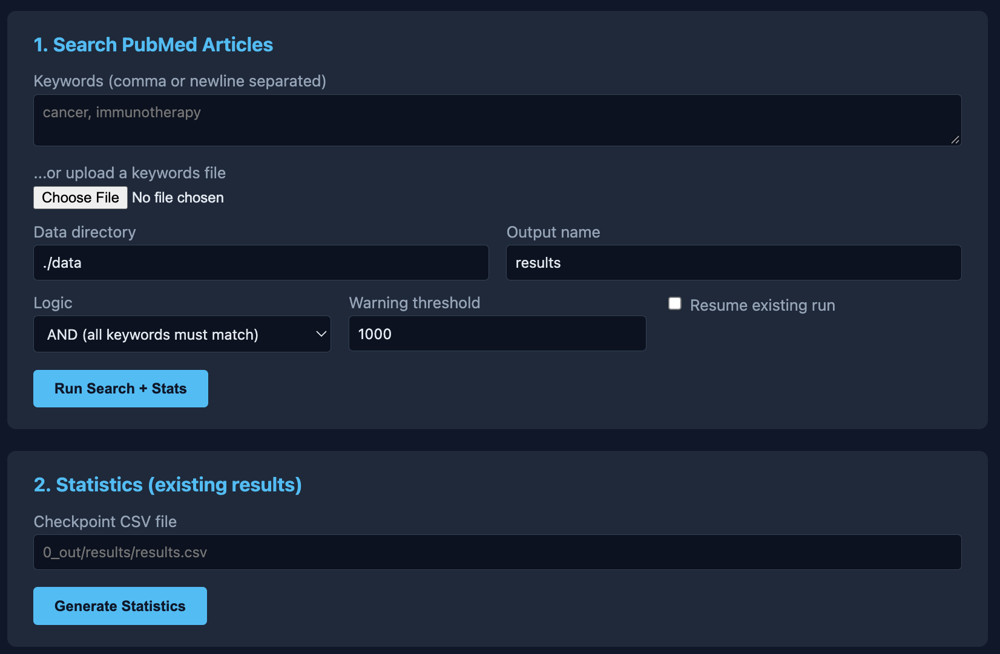
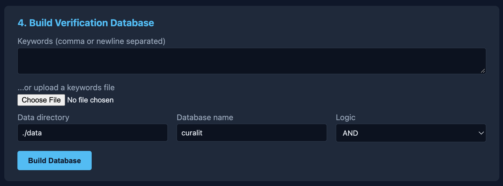
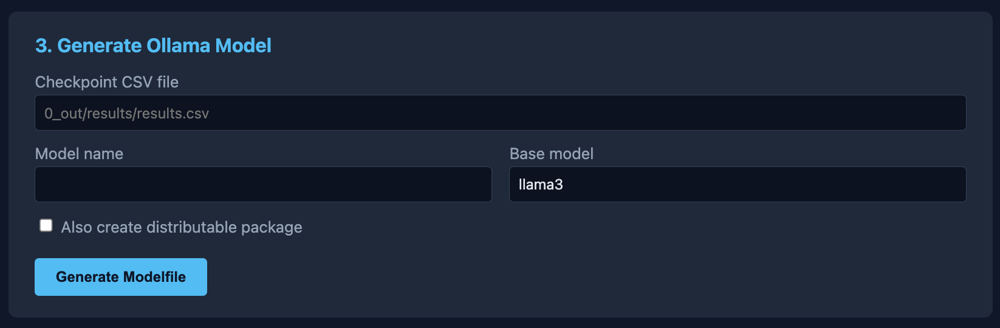
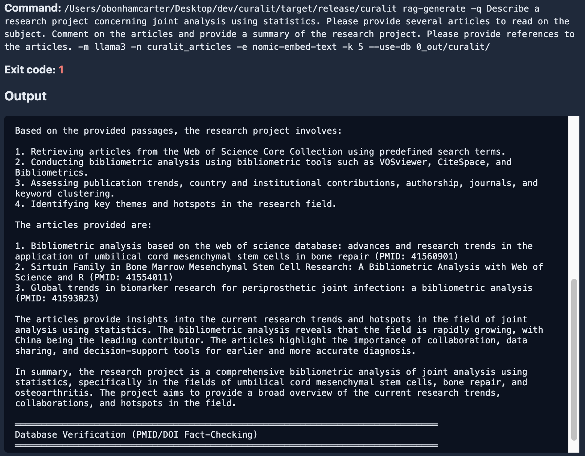
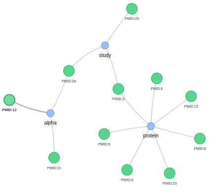
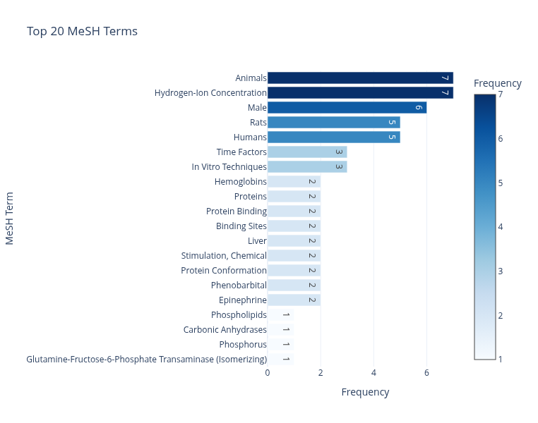
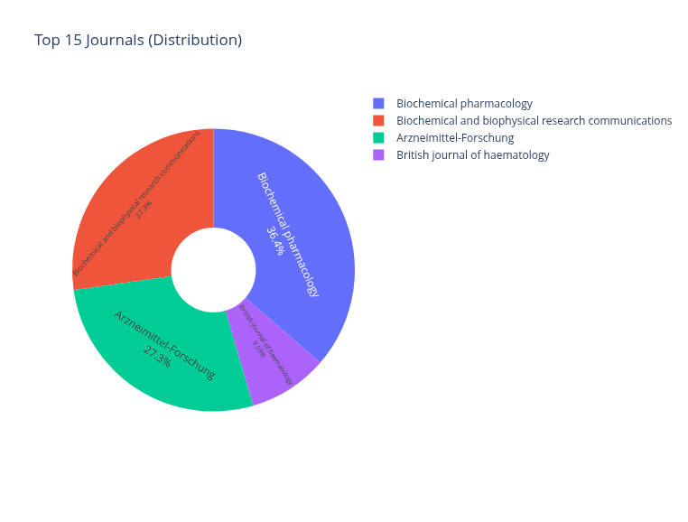

# Welcome {background-color="#e7f3ff"}

**Project:** [github.com/developmentAC/curalit](https://github.com/developmentAC/curalit)

Oliver Bonham-Carter

email: obonhamcarter at allegheny.edu

## What We'll Cover

:::: {.columns}
::: {.column width="60%"}
1. What CuraLit is and how it works
2. What you can use it for
3. Setting it up, step by step
4. Using the **browser interface**
5. Understanding your output
6. Troubleshooting
:::

::: {.column width="40%"}
{fig-alt="CuraLit logo"}

::: {.callout-tip}
No programming experience needed. Every step is copy-and-paste.
:::
:::
::::

# What is CuraLit? {background-color="#e8f5e9"}

## In One Sentence

::: {.callout-note}
CuraLit finds PubMed articles that match your **keywords**, then lets you **ask questions** and **brainstorm project ideas** with an AI that answers from those real articles.
:::

- Runs **locally** (via Ollama): your questions stay private
- Answers are grounded in real, citable papers
- A **fact-check database** catches invented PMIDs, authors, and DOIs
- Use it from the **browser** or the command line

## The Problem It Solves

:::: {.columns}
::: {.column width="50%"}
- PubMed holds tens of millions of articles
- General AI chatbots can **make up** references
- Beginners struggle to find a starting point
:::

::: {.column width="50%"}
CuraLit narrows the field to **your topic** and keeps the AI tied to **real articles**.
:::
::::

# How It Works {background-color="#f3e5f5"}

## The Method

```{mermaid}
%%| fig-width: 11
%%| fig-height: 3.5
graph LR
    A[Your keywords] --> B[Search PubMed files]
    B --> C[results.csv<br/>matching articles]
    C --> D[Statistics &<br/>visualizations]
    C --> E[Fact-check<br/>database]
    C --> F[RAG index]
    F --> G[Ask questions<br/>cited answers]
    E --> G
    style A fill:#e3f2fd
    style C fill:#fff9c4
    style G fill:#c8e6c9
```

## What is RAG?

**RAG = Retrieval-Augmented Generation**

1. **Embed**: articles are turned into numbers that capture meaning (`nomic-embed-text`) and stored in Qdrant
2. **Retrieve**: your question finds the most relevant articles
3. **Generate**: the model (e.g. `llama3`) answers using **only that text**
4. **Verify**: citations are checked against a SQLite database

## Two Ways to Build a Model

:::: {.columns}
::: {.column width="50%"}
### RAG (recommended)

- Quick, no training
- Answers quote your articles
- Works with the fact-check database
:::

::: {.column width="50%"}
### Fine-tuned model (optional)

- A standalone Ollama model
- Easy to share with colleagues
- Created with `curalit generate`
:::
::::

# Use Cases {background-color="#fff3e0"}

## How Early-Career Researchers Use It

- **Brainstorm** project ideas from current literature
- **Find gaps**: ask "what is not yet studied?"
- **Literature reviews**: get a reading list with comments
- **Refine hypotheses** and ask about methods
- **Grant and thesis background**: collect references quickly
- **Teaching**: share a topic model with students or lab members

## Example Question

> "Describe a research project concerning prosthetics. Provide several articles to read, comment on them, and give references."

The answer lists article titles, PMIDs, and comments that you can look up and verify.

# Setting Up {background-color="#e3f2fd"}

## What You Need

| Tool | What it does | Needed for |
|---|---|---|
| [Rust](https://rustup.rs) | Builds the CuraLit program | Everything |
| [Ollama](https://ollama.ai/download) | Runs AI models on your computer | Models and RAG |
| [Qdrant](https://qdrant.tech/) (via Docker) | Stores article embeddings | RAG only |
| [uv](https://astral.sh/uv/) | Manages the Python parts | Charts and browser UI |

::: {.callout-tip}
Recommended: 8 GB+ RAM and free disk space for PubMed files.
:::

## Step 1a: Install Rust and uv (Mac / Linux)

Open **Terminal**, then run:

```bash
curl --proto '=https' --tlsv1.2 -sSf https://sh.rustup.rs | sh   # Rust
curl -LsSf https://astral.sh/uv/install.sh | sh                  # uv
```

Close and reopen the terminal afterwards.

## Step 1b: Install Rust and uv (Windows)

1. Download the installer from [rustup.rs](https://rustup.rs) (it may ask for the Visual Studio C++ Build Tools)
2. Open **PowerShell** and run:

```powershell
powershell -ExecutionPolicy ByPass -c "irm https://astral.sh/uv/install.ps1 | iex"
```

3. Install [Git](https://git-scm.com/downloads) and [Docker Desktop](https://www.docker.com/products/docker-desktop/)

## Step 1c: Install Ollama and Models

Install Ollama from [ollama.ai/download](https://ollama.ai/download) (all systems), then:

```bash
ollama pull llama3
ollama pull nomic-embed-text
```

::: {.callout-note}
Mac / Linux users also need [Docker](https://docs.docker.com/get-docker/) for the RAG step.
:::

## Step 2: Get CuraLit

```bash
git clone git@github.com:developmentAC/curalit.git
cd curalit

cargo build --release     # builds the program (a few minutes)
uv sync                   # installs the Python parts
```

## Step 2b: Check It Worked

```bash
./target/release/curalit --version        # Mac / Linux
```

```powershell
.\target\release\curalit.exe --version    # Windows (PowerShell)
```

You should see the CuraLit version number.

## Step 3: Get PubMed Data

1. Open the [PubMed Baseline](https://ftp.ncbi.nlm.nih.gov/pubmed/baseline/) (optionally also [Updatefiles](https://ftp.ncbi.nlm.nih.gov/pubmed/updatefiles/))
2. Download some `.xml.gz` files
3. Unzip them (Mac/Linux: `gunzip *.xml.gz`; Windows: 7-Zip or right-click *Extract*)
4. Put the `.xml` files in a folder called `data/` inside `curalit`

::: {.callout-warning}
CuraLit reads `.xml` files, not `.xml.gz`. Each file is about 500 MB unzipped.
:::

## Quick Test with Sample Data

The project includes `sample_data/synthetic_pubmed_sample.xml`: 30 **invented** articles (fake PMIDs 9000001+). They are for practice only.

```bash
./target/release/curalit search -k "prosthetic" -k "joint" -d ./sample_data -o demo
```

You should see **12 matching articles** in `0_out/demo/`.

## Quick Test: Windows

```powershell
.\target\release\curalit.exe search -k prosthetic -k joint -d .\sample_data -o demo
```

Try other keywords too, such as `diabetes` or `cancer`.

::: {.callout-tip}
In the browser interface, set the data folder to `sample_data`.
:::

## Step 4: Start Qdrant (for RAG)

```bash
docker run -p 6333:6333 -p 6334:6334 \
  -v $(pwd)/qdrant_storage:/qdrant/storage qdrant/qdrant
```

Leave this window open while using CuraLit, and make sure Ollama is running.

# The Browser Interface {background-color="#e1f5fe"}

## Start It

```bash
uv run webui/app.py
```

Then open **<http://127.0.0.1:5050>** in your browser.

- Every CuraLit command is a simple form
- Results, logs, and report links appear on the page
- Everything stays on your computer

## If the Browser Page Has Problems

::: {.callout-tip}
If the page cannot find `curalit`, build it first (`cargo build --release`) or set `CURALIT_BIN=/path/to/curalit` before running the app.
:::

::: {.callout-note}
Keep the terminal window open while you use the page. Press `Ctrl+C` in the terminal to stop it.
:::

## Browser Step 1: Search

{fig-alt="Search page screenshot"}

Enter keywords, choose the data folder, name the run, and press run.

## Browser Step 2: Fact-Check Database

{fig-alt="Database page screenshot"}

Lets PMIDs, authors, and DOIs be checked against real records.

## Browser Step 3: Build a Model

{fig-alt="Model generation page screenshot"}

Build the RAG index or an Ollama model from your results.

## Browser Step 4: Ask Questions

{fig-alt="Questions page screenshot"}

Brainstorm, ask about methods, and refine hypotheses.

# Command-Line Equivalent {background-color="#f3e5f5"}

## The Whole Workflow

```bash
# 1. Search (creates 0_out/myResults/)
curalit search -k "prosthetic" -k "joint" -k "analysis" -d ./data -o myResults

# 2. Explore charts
uv run 0_out/myResults/visualize.py

# 3. Build fact-check database
curalit db-build -k "prosthetic" -k "joint" -k "analysis" -d ./data -n myResults
```

## The Whole Workflow (continued)

```bash
# 4. Build RAG index
curalit rag-build -c 0_out/myResults/results.csv

# 5. Ask a question
curalit rag-generate -m llama3 \
  -q "What research projects could I do on prosthetic joints?" \
  --use-db 0_out/myResults/database.db
```

::: {.callout-note}
If `curalit` is not installed, use `./target/release/curalit` (Windows: `.\target\release\curalit.exe`). Windows users: put each command on one line, without the `\`.
:::

## Choosing Keywords

:::: {.columns}
::: {.column width="50%"}
**All must match** (default)

```bash
-k "diabetes" -k "insulin"
```

Focused, fewer results
:::

::: {.column width="50%"}
**Any can match**

```bash
-k "diabetes" -k "glucose" -l or
```

Broader, more results
:::
::::

::: {.callout-tip}
Aim for about 50-500 articles. Too many? Add keywords. Too few? Use OR. Keywords can also be loaded from a file with `-f keywords.txt`.
:::

## Optional: A Standalone Model

```bash
curalit generate -c 0_out/myResults/results.csv -m my-medical-llm -b llama3
ollama create my-medical-llm -f 0_out/myResults/Modelfile_my-medical-llm
ollama run my-medical-llm
```

Share with `curalit package` (models) or `curalit rag-package` (RAG indexes).

# Understanding Your Output {background-color="#fff3e0"}

## Where Everything Goes

```
0_out/
  myResults/
    results.csv        <- matched articles
    stats.json / .log  <- corpus statistics
    visualize.py       <- run to open charts
    database.db        <- fact-check database
    Modelfile_<name>   <- model settings (if generated)
    report.md          <- readable summary of the run
```

Running the same name twice creates `myResults_2/` instead of overwriting. Use `--resume` to continue an interrupted run.

## Reading the Charts: Network

{fig-alt="Keyword and article network"}

Shows how keywords and articles connect. Dense clusters show central themes.

## Reading the Charts: MeSH Terms

{fig-alt="MeSH term frequency"}

MeSH terms are standard subject headings. Common terms suggest keywords to add; rare ones may be gaps.

## Reading the Statistics

{fig-alt="Pie chart of results"}

- `results.csv` lists each matched article and the keywords it matched
- Check journals, years, and top terms to see if your search is on target
- `report.md` is a plain-language summary

## Reading an Answer

1. **Answer text**: a draft from the AI, based on retrieved articles
2. **Citations**: titles, PMIDs, authors
3. **Verification**: references found in `database.db` are confirmed real
4. **Record**: each Q&A is saved to `0_out/<collection>_report.md`

::: {.callout-warning}
AI can still make mistakes. Look up each PMID on PubMed before relying on a claim.
:::

# Troubleshooting {background-color="#ffebee"}

## Common Problems

| Problem | Fix |
|---|---|
| "No XML files found" | Files must be `.xml`, not `.xml.gz` |
| RAG cannot connect | Start Qdrant (Docker); run `ollama pull nomic-embed-text` |
| Browser cannot find `curalit` | Run `cargo build --release` or set `CURALIT_BIN` |
| Model not found | `ollama pull llama3` (or your chosen model) |
| Too many results | Add keywords or use AND |
| Too few results | Use OR or broader keywords |

# Wrap-Up {background-color="#e8f5e9"}

## Quick Recap

1. **Search** PubMed with keywords
2. **Explore** statistics and charts
3. **Build** a database and RAG index
4. **Ask** questions and brainstorm
5. **Verify** every reference

::: {.callout-tip}
Start small: the sample data, 2-3 keywords, one question.
:::

## Contact

**Project:** [github.com/developmentAC/curalit](https://github.com/developmentAC/curalit)

Oliver Bonham-Carter

email: obonhamcarter at allegheny.edu
